# PRAKTIKUM PEMPROGRAMAN WEB

Nama : Komarudin

NIM : 312010068

Kelas : TI.20.D1

## Belajar Membuat Javascript

### Langkah-langkah Praktikum

Persiapan membuat dokumen HTML dengan nama file <b>lab5_javascript.html</b>

    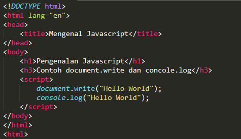

    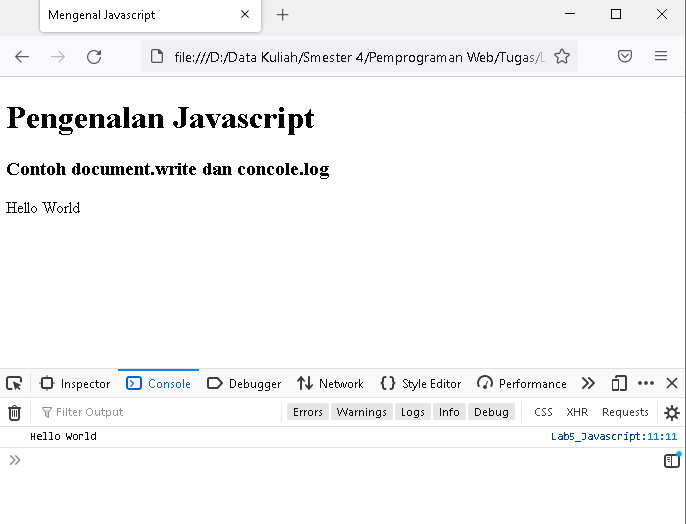

<b>Javascrip Dasar</b>

Pemakaian Alert sebagai property window.

    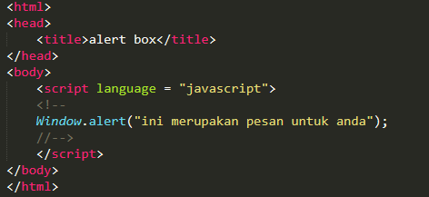

Pemakaian method dalam objek

    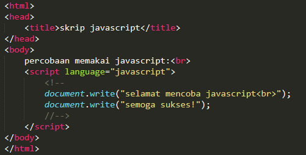

Pemakaian Prompt

    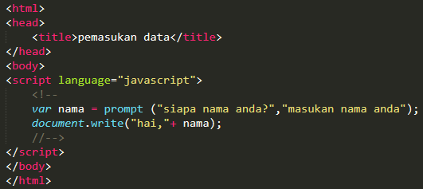

Pembuatan fungsi dan cara pemanggilannya

    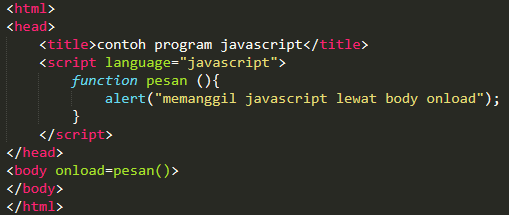

<b>Dasar Pemprograman Di Javascript</b>

Operasi dasar aritmatika

    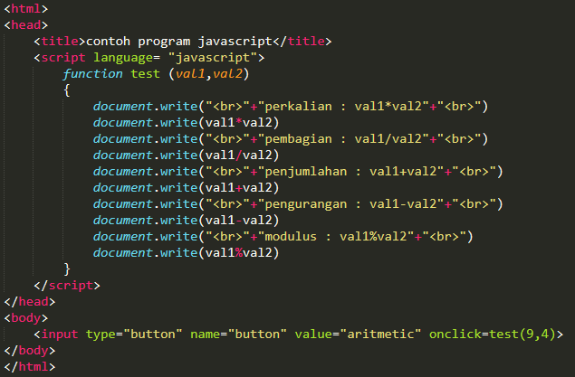

Seleksi kondisi(if..else)

    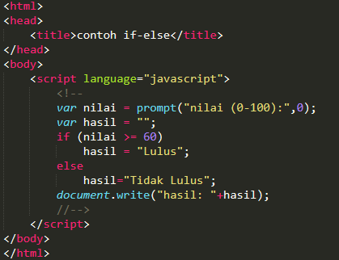

Penggunaan operator switch untuk seleksi kondisi

    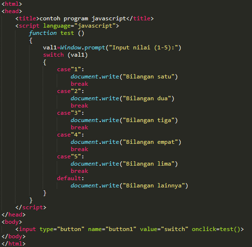

<b>Pembuatan Form</b>

Form Input

    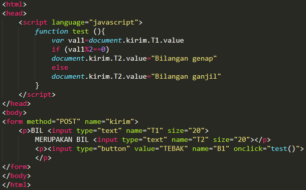

Form Button.

    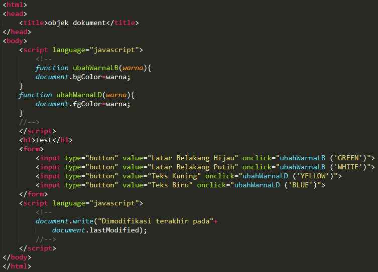

<b>HTML DOM</b>
pilihan menggunakan checkBox dengan perhitungan otomatis

    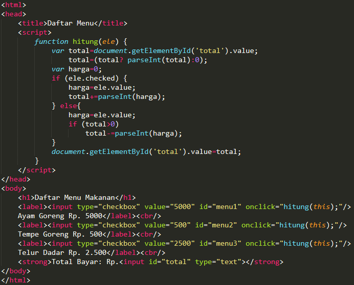

